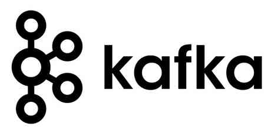
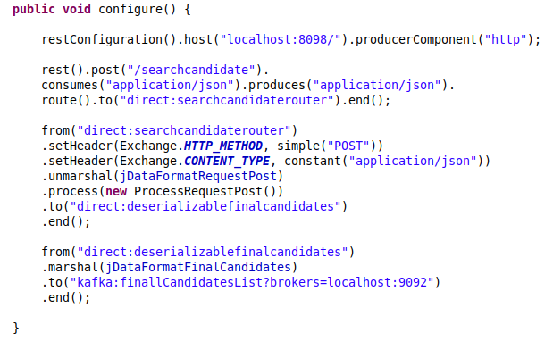

# Search-Best-Candidates-GitHub
Utilizado o Apache Camel (routing engine) para criar as rotas, seguindo as boas práticas do Enterprise Integration Patterns,
onde o mesmo cita as vantagens e desvantagens de cada padrão e define um vocabulário comum a ser seguido. O Apache Camel, como framework de integração, implementa a maioria dos padrões de integração.

 

# Objetivo
Aplicação Desenvolvida para localizar no GitHub Desenvolvedores por filtros de Linguagens e Frameworks, afim de auxiliar Recrutadores da área de Tecnologia, em síntese, o Usuário irá selecionar até 3 linguagens e obrigatóriamente 3 frameworks, medida adotada afim de filtrar bastante os resultados da Consulta na API Do GitHub, a aplicação ira realizar uma consulta na API do GitHub conforme passado os parâmetros e com base nos repositórios dos usuários fará a mineração dos dados, e trará os melhores candidatos, ferramenta extramamente útil para mineraço de dados e análise de requisitos, você também poderá informar a localização em que deseja encontrar os candidatos, Mas lembre-se a API do GitHub em sua documentação deixa explicito que a consulta é exata, logo somente o que for pesquisado estritamente será o resposta.

## Ciclo de Vida da Informação
Esta aplicação ficará aguardando o input dos dados através de uma requisição HTTP POST, necessáriamente aguardando um objeto, descrito em Json como segue abaixo:

#### Abaixo exemplo do Objeto a ser informado no body da Requisição POST 

{

  "perfil":{
  
  "languages": ["Java","JavaScript","Go"],                                    
                                                                                
  "frameworks" : ["Junit","Swagger","Mockito"],
  
  "location": "Uberlândia"}
  
}

#### Abaixo Segue a Resposta, que também será enviada a um Tópico no Kafka que falaremos mais adiante

   Tal EndPoint está sendo disponibilizado pelo Apache Camel no caminho : http://localhost:8098/:0/searchcandidate , ao receber o Json, fará o transporte da informação para  a rota "direct:searchcandidaterouter", em tal rota esse Json será processado serializado em objeto Java e em "ProcessRequestPost()", será feito a interceptação do body da requisição e trabalhada a informação, sendo realizado a serialização do mesmo, do Json para um Objeto Java através do Processador Jackson, uma vez que os dados estão no objeto Java, o mesmo é transportado por vários métodos que farão a montagem da query de pesquisa na API do GitHub, bem como o consumo da mesma e por fim será retornado em um outro objeto os candidatos que se enquadrão nos parâmetros de busca informado, seguindo o padrão informado acima, esse Objeto será transportado para uma segunda rota, a   "direct:deserializablefinalcandidates", nesta rota, será feito a deserialização, do Objeto para Json e por fim enviado ao Tópico do Kafka chamado "finallCandidatesList". Abaixo Segue Trecho da Implementação descrita.

## Apache Kafka
  O Apache Kafka é uma plataforma open-source de processamento de streams, o mesmo fará a gestão das mensagens enviadas pelo Apache Camel e usando o Protocolo WebSocket, o Front-End fará o consumo das mensagens deste tópico e exibirá os finalistas no Browser.

## Front-End  - ReactJS
Front-End Será Desenvolvido e Disponibilizado em meus repositórios futuramente, ReactJS.

## Executando e testando o projeto

### Pré-requisitos
* Java 8

1.1 Para rodar os testes:

##Obs para rodar os testes lembre-se que o maven precisa estar instalado. 

`$ mvn test #Para rodar os testes`

1.2 Para buildar a aplicação:

`$ mvn clean install #buildando o pacote da aplicação`

## Principais tecnologias e frameworks utilizados

- Java 8
- Apache Camel
- Apache Kafka
- DataBase NoSql Cassandra
- JUnit 5
- Swagger

