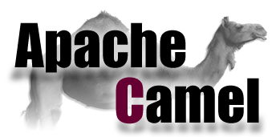

# Search-Best-Candidates-GitHub
Utilizado o Apache Camel (routing engine) para criar as rotas, seguindo as boas práticas do Enterprise Integration Patterns,
onde o mesmo cita as vantagens e desvantagens de cada padrão e define um vocabulário comum a ser seguido. O Apache Camel, como framework de integração, implementa a maioria dos padrões de integração.

# Objetivo
Aplicação Desenvolvida para localizar no GitHub Desenvolvedores por filtros de Linguagens e Frameworks, afim de auxiliar Recrutadores da área de Tecnologia, em síntese, o Usuário irá selecionar até 3 linguagens e obrigatóriamente 3 frameworks, medida adotada afim de filtrar bastante os resultados da Consulta na API Do GitHub, a aplicação ira realizar uma consulta na API do GitHub conforme passado os parâmetros e com base nos repositórios dos usuários fará a mineração dos dados, e trará os melhores candidatos, ferramenta extramamente útil para mineraço de dados e análise de requisitos, deixei por default até então trazer somente os desenvolvedores da Cidade de Uberlãndia.

## Front-End
Front-End Será Desenvolvido e Disponibilizado em meus repositórios futuramente, em Angular 8.

## Executando e testando o projeto

### Pré-requisitos
* Java 8

1.1 Para rodar os testes:

##Obs para rodar os testes lembre-se que o maven precisa estar instalado. 

`$ mvn test #Para rodar os testes`

1.2 Para buildar a aplicação:

`$ mvn clean install #buildando o pacote da aplicação`

## Principais tecnologias e frameworks utilizados

- Java 8
- Apache Camel
- Apache Kafka
- DataBase NoSql Cassandra
- JUnit 5
- Swagger

